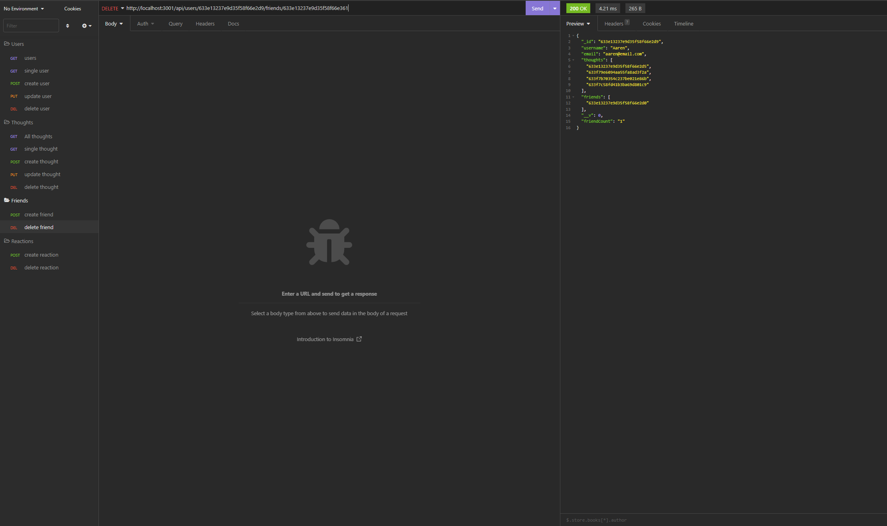

# Social Network API

## Description

This is an application that interfaces with a MongoDB database using mongoose ODM.
This is the back end implementation of a social network web application where users can share their thoughts, react to friends’ thoughts, and create a friend list.

There are 3 main tables, Categories, Products and Tags.

- A category can have many Products.
- A Product can have many Tags
- A Tag can be against many Products.

These tables are related to develop a relationship as an e-commerce backend .

Express JS routing is used so that a front end can interface with the back end implementation.
This way the database can be searched, items can be created, updated and deleted and relationships with data in tables created properly in the back end.
The details of the API calls are explained in the Express API Information section.

<br>

## Table of Contents

- [GitHub Link](#link)
- [Installation Instructions](#install-instructions)
- [Executing Instructions](#executing-instructions)
- [Database Information](#database-information)
- [Express API Information](#express-api-information)
- [Video Demo](#video-demo)
- [Screen Shots](#screen-shots)

---

## Link

The link to the GitHub repository of the assignment is <br>
[https://github.com/jkoufalas/Social-Network-API](https://github.com/jkoufalas/Social-Network-API)

---

## Install Instructions

### MongoDB

Since this application uses MongoDB there needs to be an instance for the application to connect to.
Therefore the user must install MongoDB before using this application.

The dependancies are listed within the package.json file. The dependancies for this application are

- mongoose
- expressjs

Since the dependancies are listed within the lock file, they will autmatically installed with the following command

```
npm i
```

---

## Executing Instructions

```
node index.js
```

## This will start the application on the server and connect it to the MongoDB database.

## Database Information

The user must have a MongoDB database installed on the machine they are running the application on.

The connection.js file located in the /config folder is what is used to connect to MongoDB and the database within it.
The database is named socialNetwork and the connection string used is.

```
mongodb://localhost/socialNetwork
```

The seed data if required can be inserted into the database by using the command

```
npm run seed
```

There are 2 Models used within the database

### Users

This has the following keys

- username - Of type string. This is a required field must be unique.
- email - Of type string. This is a required field must be unique.
- thoughts - Array of \_id values referencing the Thought model.
- friends - Array of \_id values referencing the User model (self-reference)
- virtual - friendCount - that retrieves the length of the user's friends array field on query.

### Thought

- thoughtText - Of type string. This is a required field and must have a length between 1 and 280 characters.
- createdAt - Of typr Date. Set by default as the current time when created.
- username - Of type string. This is a required field.
- reaction - Array of nested documents created with the reactionSchema
- virtual - reactionCount - that retrieves the length of the thought's reactions array field on query.

There is 1 Schema used

### Reaction

- reactionId - Default value is set to a new ObjectId.
- reactionBody - Of type string. This is a required field.
- username - Of type string. This is a required field.
- createdAt - Of typr Date. Set by default as the current time when created.

## Express API Information

Express.js is used to interact to the database using the routes

### User Routes

- Get /api/users, returns all users
- Get /api/users/:usedId where the id is for a singular user id, returns a single users information
- Post /api/users, creates a user

```
{
  "username": "lernantino121",
  "email": "lernantino121@gmail.com"
}
```

- Put /api/users/:usedId, modifies a user data with usedId

```
{
  "username": "Aaran1",
  "email": "aaran@email.com"
}
```

- delete /api/users/:usedId, deletes a user with id, it will also delete all their associated thoughts

- Get /api/thoughts, returns all thoughts
- Get /api/thoughts/:thoughtid where the thoughtid is for a singular thought, returns a single thoughts
- Post /api/thoughts, creates a thought and uses the userId to assign it to a user.

```
{
  "thoughtText": "Here's a cool thought...",
  "username": "larantino121",
  "userId": "633f95fb2f6dd81998c3cb6f"
}
```

- Put /api/thoughts/:thoughtid, updates a thought with the data by using the thoughtid

```
{
  "thoughtText": "Here's a NEW cool thought..."
}
```

- delete /api/thoughts/:thoughtid, deletes a thought with thoughtid

- Post /api/users/:userId/friends/:friendId, adds a friend (another user) using friendId as a friend to user with userId
- delete /api/users/:userId/friends/:friendId, removes the friend (another user) using friendId as a friend to user with userId

- Post /api/thoughts/:thoughtId/reactions, creates a reaction and adds it to a thought using thoughtId

```
{
	"reactionBody": "wild stuff",
	"username": "Zen"
}
```

- delete /api/thoughts/:thoughtId/reactions, removes the reaction from a thought

```
{
	"reactionId": "633f8856fac2922b7dad11a9"
}
```

## Video Demo

[Link to Demo](https://youtu.be/5gl82jAUN4w)

Select the 1080p option for better resolution of text.

The demonstration video covers the following.

- The install instructions.
- How to run the application.
- A walkthrough of all the API calls for Users, Thoughts, Friends and Reactions

---

## Screen Shots

### Get Users


### Get Users by id


### POST User


### PUT User


### Delete User


### Get Thoughts


### Get Thought by id


### POST Thought


### PUT Thought


### Delete Thought


### POST Friend


### DELETE Friend



### POST Reaction


### Delete Reaction


---
